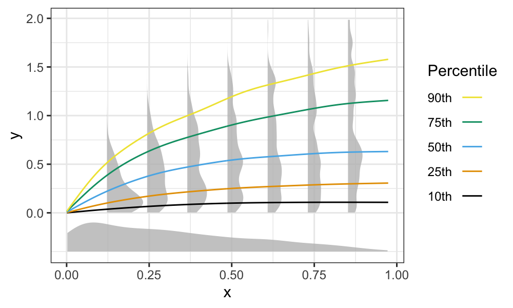

# How to use quantileplot function

## Download and install quantileplot package

Method 1: `devtools::install_github()`
Because this is still in a private repo, you will run 

`install_github("robincrlee/quantileplot", auth_token = STRING)`
auth_token string can be created by following this instruction. 
https://docs.github.com/en/github/authenticating-to-github/creating-a-personal-access-token 

Method 2: 
1. git clone this repo
2. Navigate to `tutorial_package` subdirectory in R or command line
3. `devtools::install()` in R or `R CMD build brocolors`


## Sample Use
- Use quantileplot function

`quantileplot(data, x, y)`

This function accepts three argument, a dataframe, x column and y column. 

```
x <- rbeta(1000,1,2)
y <- log(1 + 9 * x) * rbeta(1000, 1, 2)
data <- data.frame(x = x, y = y)
quantileplot(y ~ s(x), data)
```


