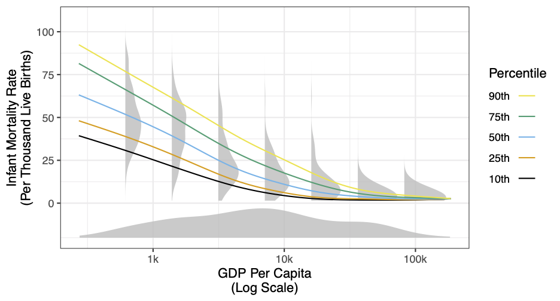
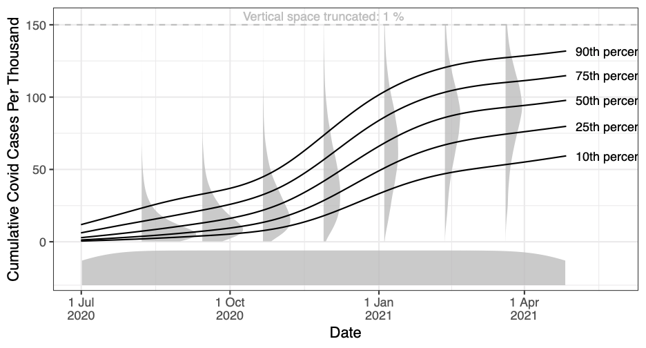
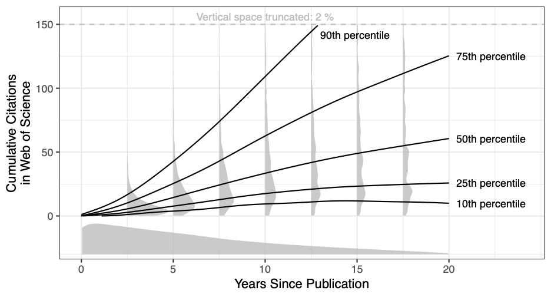
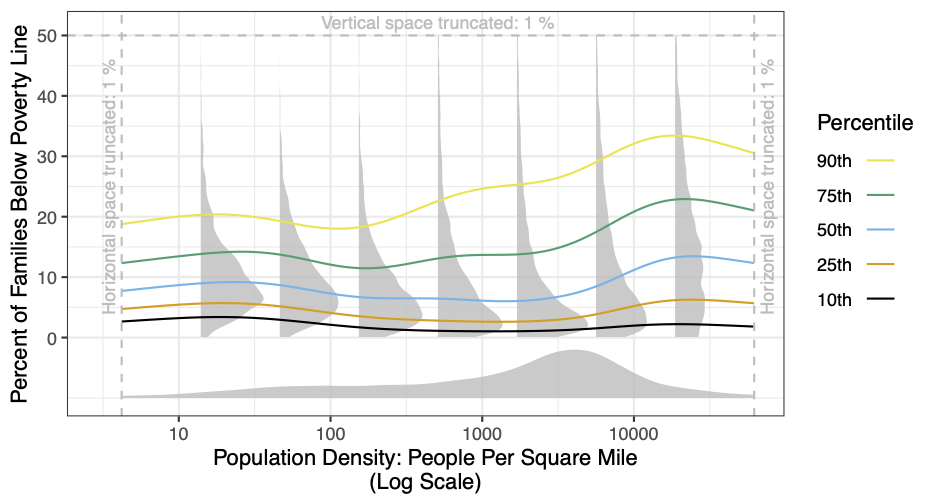
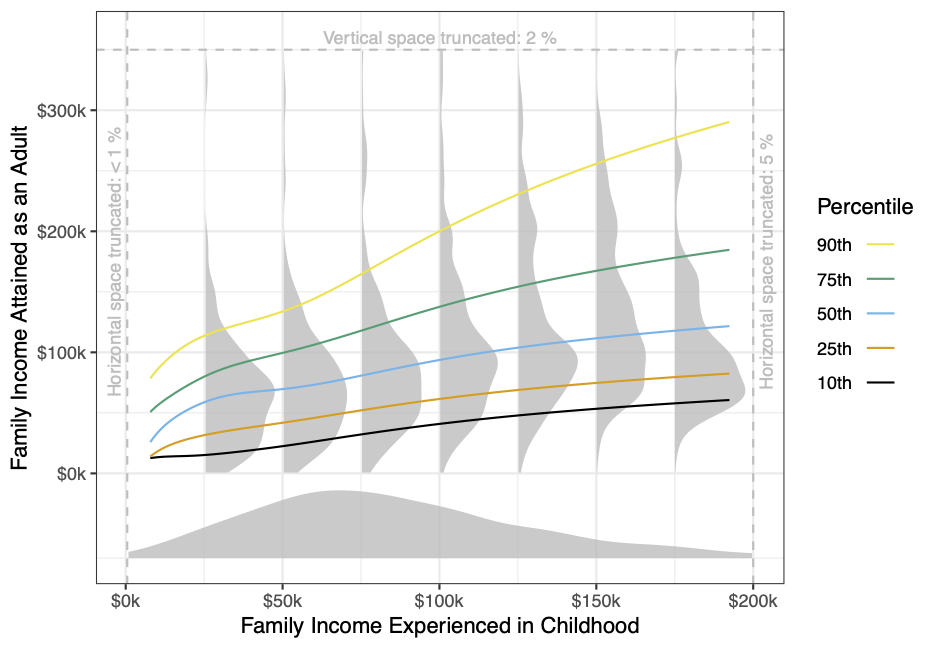
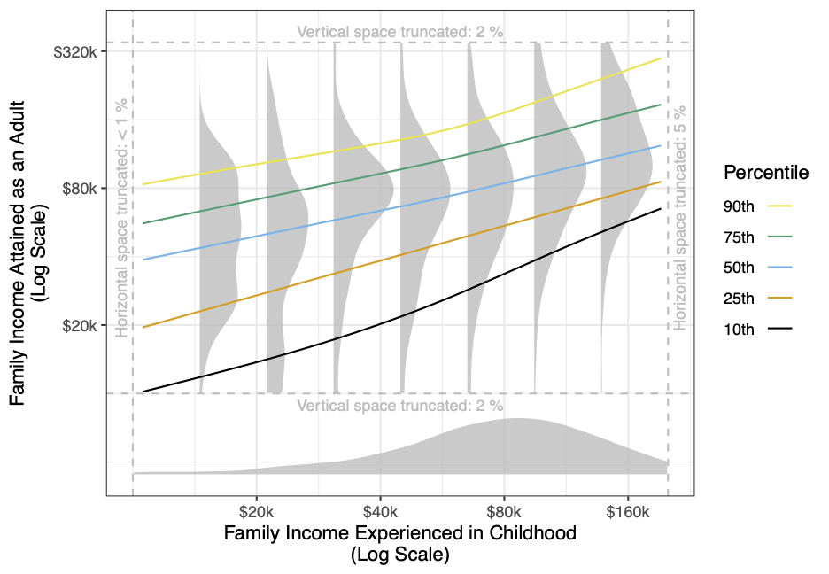
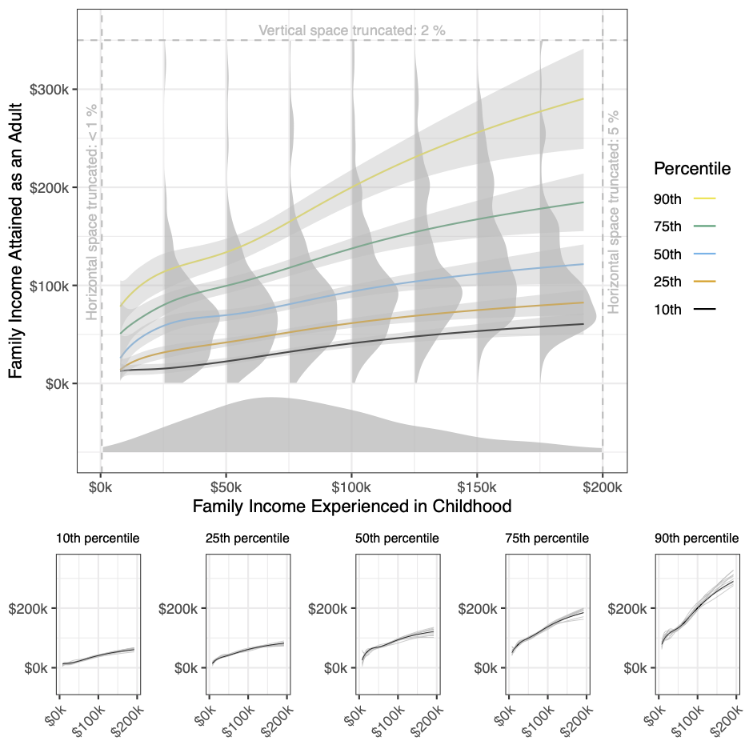

---
abstract: |
  **The goal of this explainer is to motivate the [quantileplot](https://ilundberg.github.io/quantileplot/). If you want guidance for using the package with code examples, you should see the [vignette](https://ilundberg.github.io/quantileplot/doc/quantileplot.html).** Nonlinearity and heteroskedasticity are the rule rather than the
  exception in bivariate demographic relationships. Visualizing those
  relationships is challenging for two reasons. On one hand, a
  scatterplot can overwhelm the reader with complexity: it is difficult
  to discern patterns when presented with all of the data. On the other
  hand, a best-fit regression line is too simple: a linear approximation
  to the conditional mean obscures nonlinear and heteroskedastic
  patterns. We propose a new visualization that combines smooth curves
  for conditional quantiles of the outcome given a predictor,
  conditional densities of the outcome at selected predictor values, and
  the marginal density of the predictor. We illustrate through a series
  of demographic examples and provide statistical software (the
  [quantileplot](https://ilundberg.github.io/quantileplot/) package for R) to support the visualization.
author:
- "Robin C. Lee[^1]"
- "Ian Lundberg[^2]"
- "Brandon M. Stewart[^3]"
bibliography:
- quantile_plot.bib
title: "The quantileplot: A smooth quantile visualization to enhance understanding of
  bivariate population distributions [^4]"
---

**Note: The [quantileplot](https://ilundberg.github.io/quantileplot/) package is actively being developed, and users should expect the functionality to change in the future.** The package is available [here](https://ilundberg.github.io/quantileplot/). The examples in this extended vignette are produced by code available [here](https://github.com/ilundberg/replication/tree/master/quantileplot_replication).

Introduction
============

Demographers regularly study pairs of continuous variables. How does
infant mortality vary as a function of GDP per capita? How does
neighborhood poverty vary with population density? How are incomes
related across generations? All of these questions involve data that
could be depicted on a scatterplot with one continuous variable on the
$x$-axis and another on the $y$-axis. But in large samples a scatterplot
becomes unwieldy as general trends become lost in a mass of points.
Researchers therefore turn to a common tool: a best-fit regression line.
A line provides a concise summary at the cost of obscuring some details,
such as nonlinear and heteroskedastic patterns. This research note
presents a new visualization tool---the quantile plot---which conveys
more information about bivariate relationships while maintaining a
concise visual summary.

A quantile plot combines three components: (1) smooth curves to depict
patterns in quantiles of the conditional distribution of the outcome,
(2) conditional density plots for the outcome distribution at selected
values of the predictors, and (3) a marginal density plot for the
predictor variable. The `quantileplot` package in R supports these
visualizations with a single line of code as simple as that used to
estimate a linear regression model. This note is structured as follows.
We first introduce quantile plots through a series of demographic
examples drawn from development, cumulative advantage, spatial
inequality, and epidemiology. We then discuss an example from
intergenerational mobility in which a quantile plot clarifies two
substantive conclusions. Having motivated the plot, we then present
methodological details and related work. We conclude by discussing the
many research questions that could be newly illuminated by quantile
plots.

Three components of a quantile plot {#sec:principles}
===================================

A quantile plot has three components: quantiles of the conditional
outcome distribution plotted as smooth functions of the predictor, the
conditional density of the outcome at selected values of the predictor,
and the density of the predictor variable.

Quantile curves to visualize trends
-----------------------------------

One reason researchers move from a scatterplot to a regression line is
to abstract beyond the details of the data and direct the attention of
the reader to trends: how the outcome changes across values of the
predictor. But a linear regression may miss important nonlinearities and
distinct patterns at the top and bottom of the distribution
(heteroskedasticity). We make improvements on both fronts by visualizing
smooth, nonlinear curves for quantiles.

Quantile curves capture nonlinear trends. For example, numerous
demographic questions relate economic conditions (GDP per capita) to
demographic outcomes like fertility and mortality
[@notestein1945; @easterlin1975; @lee2003]. But those relationships are
often nonlinear. For example, infant mortality is strongly related to GDP
per capita among countries with low GDP per capita. Above a certain
point, infant mortality is already near zero and is only weakly related
to GDP per capita.

{width=60%}

Quantile curves capture the nonlinearity. Without
quantile curves, a researcher might devote substantial effort searching
for a transformation of the data (e.g. log) such that trends would be
approximately linear. By moving away from linearity, quantile curves
render that task unnecessary. A pivot away from linear summaries also
allows one to capture non-linear trends that would be difficult to
transform to a line, such as the bump in COVID-19 cases in winter
2020--2021. With quantile curves, nonlinearities cease
to be a nuisance and instead become a topic for substantive inquiry.

{width=60%}

Quantile curves also depict variation in trends across the distribution
of the outcome variable. These trends are especially distinct in
settings with heteroskedasticity: the variance of the outcome is higher
at some values of the predictor than others. Heteroskedasticity arises
for many reasons in demographic research. One common source is
cumulative advantage [@diprete2006]. If large positive outcomes tend to
accrue to those who already have large positive outcomes, then the
variance (inequality) in the population grows over time. This is true,
for example, in scientific citation patterns.

{width=60%}

All articles published in *Demography* have
very few articles immediately after publication: the distribution is
very tight. As years pass since the publication date, the distribution
of citations across articles becomes increasingly high-variance. The
90th percentile of citations rises very quickly with time while the 10th
percentile is approximately flat. A single regression line cannot
capture these distinct trends: by reducing the distribution to its mean,
a regression obscures distinct patterns across the distribution.
Quantile curves highlight those distributional trends.

Conditional densities to visualize full distributions
-----------------------------------------------------

Quantiles provide only a coarse view of the entire outcome distribution
that exists at each value of the predictor. A quantile plot visualizes
several complete conditional distributions with vertical densities.
While regression-line summaries focus on the central tendency of the
distribution, conditional densities emphasize the full range of outcomes
that are observed. For example, consider the distribution of poverty
across Census tracts at a given population density. Scholarship has long emphasized the
concentration of poverty in inner cities [@park1925; @wilson1987], but
recent work has raised the fact of substantial suburban and rural
poverty [@murphy2007; @lichter2012; @allard2017]. There are also urban,
suburban, and rural places with very low levels of poverty. Conditional
densities illustrate the entire distribution: at every population
density, there are many non-poor tracts but also a long upper tail of
extremely poor tracts.

{width=60%}

Marginal density to visualize the predictor distribution
--------------------------------------------------------

A conditional distribution (e.g. poverty given population density) is
best understood with respect to the marginal distribution of the
predictor (e.g. the distribution of population density). One reason to
care about suburban poverty is because just over half (52%) of Census
tracts have population densities between 1k and 10k per square mile
(e.g. Scranton, Harrisburg), and these tracts are home to just over half
(54%) of Americans. More rural places are home to 35% of Americans
(e.g. Lancaster) while more urban places are home to only 11% of
Americans (e.g. Philadelphia). The marginal and conditional densities
work together: the marginal density directs attention to the conditional
densities with the greatest population mass.[^5]

Fanning out or fanning in? Quantile plots change interpretations of intergenerational mobility {#sec:mobility}
==============================================================================================

Putting these components together, a quantile plot can change
substantive interpretations. Consider the well-known fact that incomes
are higher among adults who were themselves raised in high-income
families [@chetty2014]. But the mean is not the whole story; there are
also patterns in the *spread* of income attainment (Figure 5). The spread of incomes is narrower
for adults who were themselves raised in low-income families and wider
for adults who were raised in high-income families. Visually, the
quantile curves "fan out" as income experienced in childhood rises.
Substantively, intergenerational income persistence is stronger among
those raised at the bottom of the distribution than among those raised
at the top because some children raised at the top of the distribution
experience further upward mobility to extremely high incomes.

{width=60%}

The "fanning out" pattern of
Figure 5 contrasts with the "fanning in" pattern of
Figure 6. When childhood income experiences and adult
income attainment are both measured on the log scale, the distribution
is slightly more compact among those raised in high-income families.
Torche ([-@torche2015]:52) remarks on this fact that "children of
wealthy parents are more likely to be homogeneously wealthy than
children of poor parents are likely to be homogeneously poor." The
interpretation here depends on the use of the log. Specifically, log
transformations convert claims from an additive to a multiplicative
scale. The difference between the 90th and 10th percentile rises as a
function of income experienced in childhood Figure 5, but the ratio
between the 90th and 10th percentile declines as a function of income
experienced in childhood Figure 6.

{width=60%}

Neither Figure 5 nor Figure 6 is more "correct." The choice is
substantive. If we want to study income ratios, we should choose the log
scale. If we want to study income differences, we should choose the
linear scale. With a linear regression, this substantive choice would be
conflated with statistical considerations about linearity and about the
influence of outliers. Quantile plots free the researcher from these
statistical considerations by directly visualizing nonlinear
associations and skewed distributions. Quantile plots therefore allow
the substantive choice of a scale to be made for substantive reasons.

Methodological details and related literature {#sec:details}
=============================================

Quantile curves are estimated by Quantile Generalized Additive Models
[@fasiolo2020], which extend methods originally developed for means to
the setting of quantiles [@hastie1990; @wood2017]. Tuning and estimation
of thin-plate splines for smooth terms is carried out automatically in
the `qgam` package on which our `quantileplot` package relies. The user
can also customize these choices. Conditional densities have long
appeared in statistical research on visualization, and we estimate by a
Gaussian product kernel following this past work
[@rosenblatt1969; @hyndman1996]. In our software package, bandwidths are
selected automatically by a rule of thumb[^6] but can be modified by the
user to produce density estimates that are smoother or more flexible.
Rule of thumb are common in automated bandwidth selection; see
@bashtannyk2001 and @hall2004. For the illustrations in this paper, we
have elected not to visualize uncertainty in order to focus the viewer's
attention on point estimates. Appendix
[7](#sec:uncertainty){reference-type="ref" reference="sec:uncertainty"}
reproduces all figures from this paper with estimates of uncertainty.

Discussion {#sec:discussion}
==========

The quantile plot enables new visualizations of bivariate population
relationships. Similar to a linear regression, quantile curves convey
the trend in the outcome as a function of the predictor variable. Unlike
linear regression, the curves capture nonlinear relationships and
distinct patterns across the distribution of the outcome variable.
Conditional densities amplify the distributional summary by illustrating
the distribution of the outcome at a series of predictor values. The
marginal density of the predictor directs the reader's attention to the
space that corresponds to the greatest mass of the population. When
variables are skewed and relationships are nonlinear and
heteroskedastic---as is often the case in demography---quantile plots
may generate particularly useful insights.

APPENDIX
============================================

Correspondence between linear and log scales {#sec:linear_log}
============================================

Let $\tau_{A\mid B}$ denote the quantile for the $A$th percentile of the
outcome among those at the $B$th percentile of the predictor. One might
say that a distribution "fans out" if the spread of outcome quantiles is
greater at the top of the predictor distribution than at the bottom.
$$\text{Fanning out, linear scale:}\quad 
    \underbrace{
        \bigg(\tau_{90\mid 90} - \tau_{10\mid 90}\bigg)
    }_{\substack{90-10\text{ difference in $Y$}\\\text{at the \textbf{90th} percentile of $X$}}}
    > 
    \underbrace{
        \bigg(\tau_{90\mid 10} - \tau_{10\mid 10}\bigg) 
    }_{\substack{90-10\text{ difference in $Y$}\\\text{at the \textbf{10th} percentile of $X$}}}$$

Now suppose that instead of $X$ and $Y$, we work with $\log(X)$ and
$\log(Y)$. The $90-10$ difference in $\log(Y)$ is the log of the
$\frac{90}{10}$ ratio in $Y$. If quantiles of a log-log plot fan out,
this implies that the $\frac{90}{10}$ ratio is greater at the 90th than
at the 10th percentile of the predictor. $$\begin{aligned}
    \text{Fanning out, log scale:}\quad 
    \underbrace{
        \bigg({\log(\tau_{90\mid 90}}) - \log(\tau_{10\mid 90})\bigg)
    }_{\substack{90-10\text{ difference in $\log(Y)$}\\\text{at the \textbf{90th} percentile of $X$}}}
    &> 
    \underbrace{
        \bigg(\log(\tau_{90\mid 10}) - \log(\tau_{10\mid 10})\bigg) 
    }_{\substack{90-10\text{ difference in $\log(Y)$}\\\text{at the \textbf{10th} percentile of $X$}}} \\
    %%%%%%%%%%%%%%%%%%%%%%%%
    \underbrace{
        \log\bigg(\frac{\tau_{90\mid 90}}{\tau_{10\mid 90}}\bigg)
    }_{\substack{\text{Log of }90/10\text{ ratio in $Y$}\\\text{at the {90th} percentile of $X$}}}
    &> 
    \underbrace{
        \log\bigg(\frac{\tau_{90\mid 10}}{\tau_{10\mid 10}}\bigg) 
    }_{\substack{\text{Log of }90/10\text{ ratio in $Y$}\\\text{at the {10th} percentile of $X$}}} \\
    \text{Because the log is a monotone function, the above}&\text{ is equivalent to}&\nonumber \\
    %%%%%%%%%%%%%%%%%%%%%%%%
    \underbrace{
        \bigg(\frac{\tau_{90\mid 90}}{\tau_{10\mid 90}}\bigg)
    }_{\substack{90/10\text{ ratio in $Y$}\\\text{at the {90th} percentile of $X$}}}
    &> 
    \underbrace{
        \bigg(\frac{\tau_{90\mid 10}}{\tau_{10\mid 10}}\bigg) 
    }_{\substack{90/10\text{ ratio in $Y$}\\\text{at the {10th} percentile of $X$}}}\end{aligned}$$

It is possible for the a relationship to fan out on the linear scale
Figure 5) but fan in on the log scale
(Figure 6).

Visualizing uncertainty {#sec:uncertainty}
=======================

The figures in the main text prioritizes point estimates over estimates
of uncertainty. When deciding whether to present uncertainty estimates,
there is a tension between providing more information and overwhelming
the viewer so that it is difficult to see the main point of the plot.
Figure 7 provides two additional
visualizations for uncertainty: 95% pointwise credible interval bands
and a panel of simulated draws from the posterior. These uncertainty
intervals rely on the analytical variance-covariance matrix estimated
for the smooth quantile curves by the `qgam` package. In general,
uncertainty is greater in regions where data are limited, which
correspond to spaces of the predictor variable with low marginal
density. Further, uncertainty tends to be greater for more extreme
quantiles (e.g. 10th and 90th percentile).

{width=60%}

The confidence bands in
above are pointwise: they correspond to
claims about the estimated quantile at a given point of the predictor.
They do not tell us the space in which the middle 95% of complete curves
would fall, which would be a more difficult problem.

[^1]: Ph.D. Student, Department of Sociology, Princeton University,
    [sociology.princeton.edu/people/robin-lee](https://sociology.princeton.edu/people/robin-lee),
    robinlee\@princeton.edu.

[^2]: Ph.D. Candidate, Department of Sociology and Office of Population
    Research, Princeton University, [ianlundberg.org](https://www.ianlundberg.org),
    ilundberg\@princeton.edu.

[^3]: Assistant Professor and Arthur H. Scribner Bicentennial Preceptor,
    Department of Sociology and Office of Population Research, Princeton
    University, [brandonstewart.org](http://www.brandonstewart.org), bms4\@princeton.edu.

[^4]: Research reported in this publication was supported by The Eunice
    Kennedy Shriver National Institute of Child Health & Human
    Development of the National Institutes of Health under Award Number
    P2CHD047879.

[^5]: The marginal density also serves as a warning: in regions with low
    marginal density, the conditional density will be more uncertain.

[^6]: Bandwidths are set at the values chosen for marginal density
    estimation by the default in the `density` function in R.
